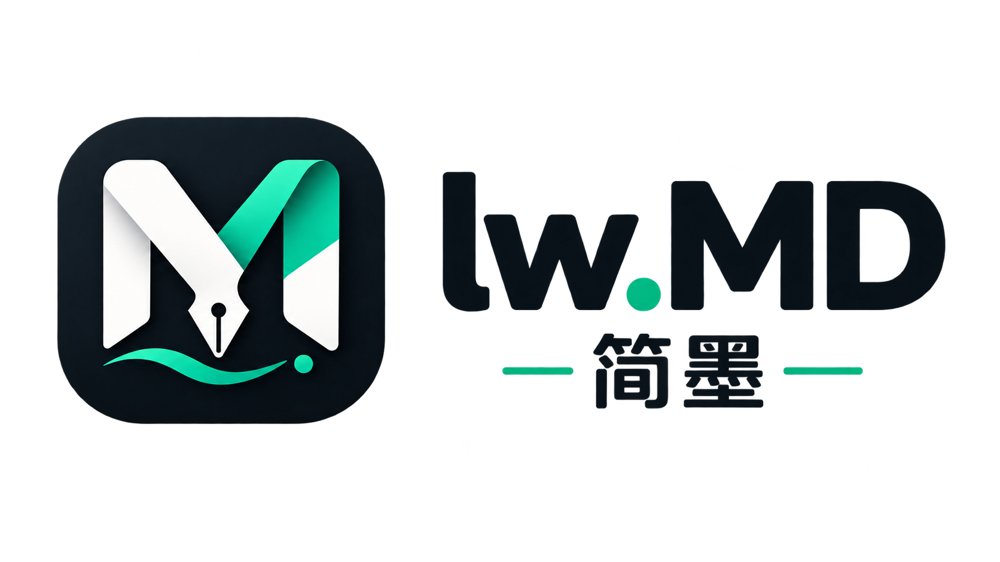
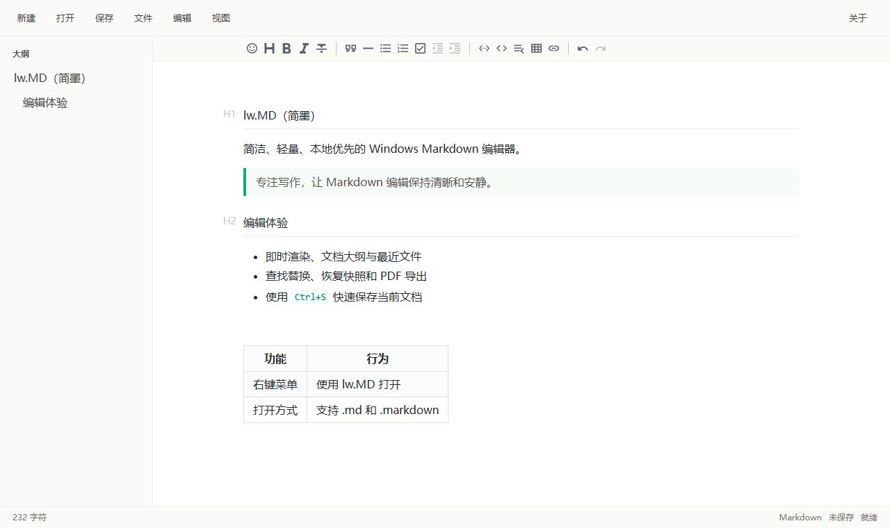

# lw.MD / Jianmo

[简体中文](README.md) | [English](README_EN.md)

[](https://github.com/lxw112190/lw.MD/actions/workflows/windows.yml)
[](LICENSE)
[](https://github.com/lxw112190/lw.MD/releases)



**lw.MD (Jianmo)** is a clean, lightweight, local-first Markdown editor for Windows. It is built with React, TypeScript, Vditor, C++17, and WebView2, and distributed as a single portable EXE.



## Features

- Instant-rendering Markdown editing with Vditor IR mode
- Offline rendering for Mermaid diagrams and inline or block KaTeX formulas
- New, open, atomic UTF-8 save, and Save As operations
- Find, replace, case-sensitive matching, and result navigation
- Drag and drop for Markdown files and images, plus clipboard image pasting
- Automatic management of the `assets` image directory beside each document
- Document outline, recent files, and light, dark, or system-following themes
- Periodic recovery snapshots for restoring unsaved work after an unexpected exit
- A4 PDF export
- Persistent window position, size, and maximized state
- Windows high-DPI and mixed-scaling multi-monitor support
- Windows context-menu, Open With, and default-app settings integration
- Fully offline frontend assets; end users do not need Node.js
- WebView2 bridge origin checks, navigation restrictions, and parameter validation

Use a fenced code block with the `mermaid` language for diagrams. Use `$E=mc^2$` for inline formulas and `$$...$$` for block formulas.

## Quick Start

1. Download the latest `lw.MD-windows-x64.zip` from [Releases](https://github.com/lxw112190/lw.MD/releases).
2. Extract the archive and run `lw.MD.exe`.
3. Select **Open**, or drag a Markdown file into the window.
4. Optionally use **File → Windows Integration...** to add context-menu and Open With entries.
5. Use **File → Export PDF** to create an A4 PDF.

Requirements:

- Windows 10/11 x64
- Microsoft Edge WebView2 Evergreen Runtime

CI-generated executables are not commercially code-signed, so Windows SmartScreen may display a warning on first launch.

## Keyboard Shortcuts

| Action | Shortcut |
| --- | --- |
| New | `Ctrl+N` |
| Open | `Ctrl+O` |
| Save | `Ctrl+S` |
| Save As | `Ctrl+Shift+S` |
| Find | `Ctrl+F` |
| Replace | `Ctrl+H` |
| Next match | `Enter` |
| Previous match | `Shift+Enter` |
| Close the find panel | `Esc` |

## Recovery Snapshots

When a document has unsaved changes, lw.MD creates a recovery snapshot about 1.5 seconds after typing stops and updates it every 15 seconds when the content changes.

- Snapshots are stored separately at `%LOCALAPPDATA%\lw.MD\recovery\current.json`.
- A snapshot never overwrites the original Markdown file.
- After an unexpected exit, the next launch offers to restore or discard the snapshot.
- Restored content remains marked as unsaved, leaving the save decision to the user.
- Saving normally or explicitly discarding changes removes the snapshot.

## Drag and Drop

- Drop Markdown anywhere in the window to open it from its original disk path and resolve relative images beside the document correctly.
- After the document is saved, use the editor's image button or drop/paste images. They are copied into the adjacent `assets` directory and inserted with relative paths.

## Windows Integration

Open **File → Windows Integration...** to register any of the following on demand:

- Show **Open with lw.MD** for `.md` and `.markdown` files.
- List **lw.MD Jianmo** in the Windows Open With picker.
- Choose lw.MD from Windows Default Apps settings; the application never takes over the default association automatically.

Registration is stored for the current user only and does not require administrator privileges. On Windows 11, the traditional context-menu command may appear under **Show more options**.

Because lw.MD is portable, moving `lw.MD.exe` makes the old registered path stale. The integration dialog then shows **Repair required**; select **Repair association** to update it. Documents with spaces or non-ASCII paths can also be opened directly from the command line:

```powershell
.\lw.MD.exe "D:\Documents\Project Notes.md"
```

## Build from Source

Node.js 20.19+, CMake 3.22+, Visual Studio 2022, and the Windows SDK are required.

```powershell
npm ci --prefix app
npm run check
cmake -S . -B build -G "Visual Studio 17 2022" -A x64 -DBUILD_TESTING=ON
cmake --build build --config Release
ctest --test-dir build -C Release --output-on-failure
```

Output:

```text
build\Release\lw.MD.exe
```

The build compresses the production frontend and embeds it in the executable. Only `lw.MD.exe` is required for distribution; recipients do not need `app/`, `dist/`, Node.js, or npm.

At runtime, the embedded frontend is extracted by content hash to `%LOCALAPPDATA%\lw.MD\frontend\`. This directory is only an internal runtime cache—the distributed application remains a single EXE.

Main project directories:

- `app/`: React, TypeScript, and Vditor frontend
- `native/`: C++17 WebView2 host, file bridge, recovery service, and Windows integration
- `tests/`: native file, recovery, launch-argument, and isolated-registry tests
- `.github/workflows/`: Windows CI and automated releases

## CI and Releases

Every push runs frontend checks, the Release build, and native tests. A downloadable `lw.MD-windows-x64` artifact is produced in GitHub Actions.

Pushing a `v*` tag that matches the project version automatically creates a GitHub Release and uploads the portable ZIP and SHA-256 checksum:

```powershell
git tag -a v0.3.8 -m "lw.MD v0.3.8"
git push origin v0.3.8
```

Tags with suffixes such as `v0.3.8-beta.1` or `v0.3.8-rc.1` are automatically published as GitHub pre-releases.

To debug WebView2 locally, set `LWMD_ENABLE_DEVTOOLS=1` before launching the application. Developer tools are disabled by default in production builds.

## License

The project source is licensed under the [MIT License](LICENSE). See [THIRD_PARTY_NOTICES.md](THIRD_PARTY_NOTICES.md) for third-party component notices.

## Contact and Support

- Author: 天天代码码天天
- QQ: 819069052
- QQ Group: C# Artificial Intelligence Practice | Group ID: 758616458

If this project is helpful to you, scan the QR code to support its maintenance:


